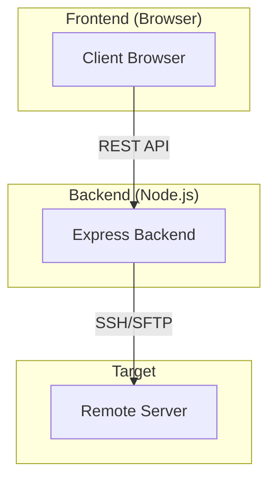

# Project Plan: SSH File Manager

## Architecture Overview
The application follows a client-server architecture:
- **Frontend**: A web-based explorer interface (HTML/CSS/JS).
- **Backend**: A Node.js/Express server that acts as a bridge between the browser and the remote server using the `ssh2` library.



## Directory Structure
```text
/
├── backend/                # Node.js Express Server
│   ├── src/
│   │   ├── index.js        # Main entry point
│   │   ├── ssh-manager.js  # SSH connection & logic
│   │   └── routes/         # API endpoints (files, auth, etc.)
│   ├── .env                # Environment variables
│   ├── .gitignore
│   └── package.json
├── frontend/               # Web Interface
│   ├── public/
│   │   ├── index.html
│   │   ├── css/
│   │   │   └── style.css
│   │   └── js/
│   │       └── app.js
│   ├── .gitignore
│   └── package.json
└── README.md
```

## Technical Stack
- **Backend**: Node.js, Express, `ssh2`, `dotenv`, `cors`.
- **Frontend**: Vanilla JavaScript (or optional framework like Vue/React if requested later), CSS for the "Windows Explorer" look.

## Next Steps
1. Create folder structure.
2. Initialize backend `package.json` and install dependencies.
3. Initialize frontend structure.
